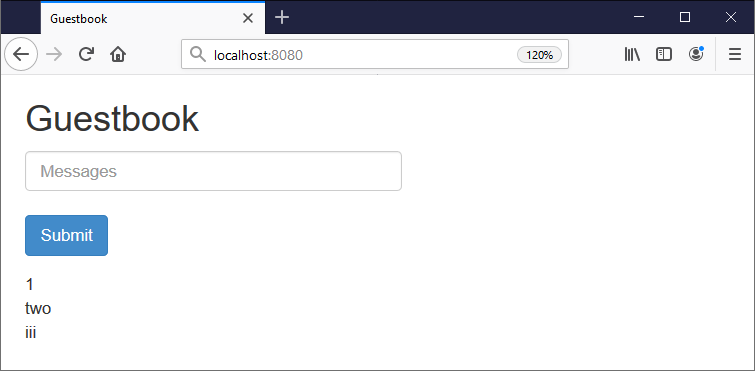

# Guestbook Demo App

Welcome to the Kubernetes Guestbook sample! It's a very simple PHP application which uses Redis as a data store.

This source code was scaffolded by a [Docker Application Template](https://github.com/sixeyed/app-template-gke-gh), together with an application manifest to deploy the app: [docker-compose.yaml](../docker-compose.yaml).

> The output also includes GitHub actions for creating a Kubernetes cluster in Google Cloud, and deploying your demo app to the cluster.

## Push this repo to create your Kubernetes cluster

Your GitHub repo should have been set up in advance by your admins. 

Open a terminal for this folder and set up the GitHub remote:

```
git init
git add --all
git commit -m "A template built all this!"
git remote add origin {{range .Services}}{{if eq "github" .ID}}https://github.com/{{.Parameters.username}}/{{.Parameters.repoName}}.git{{end}}{{end}}
```

Push the code to GitHub. This will start an action to create your GKE cluster:

```
git push -u origin master
```

The actions use secrets from your repo to connect to GCP. Then it:

- creates a GKE cluster 
- deploys [Helm](https://helm.sh) on the cluster
- deploys [Compose on Kubernetes](https://github.com/docker/compose-on-kubernetes) on the cluster

## Meanwhile... run the app locally

Docker Application Designer uses the [docker-compose.yaml](../docker-compose.yaml) manifest to run the app locally.

Click _Start_ in Application Designer in the app isn't already running. Then browse to:

- http://localhost:{{.Parameters.externalPort}}

You should see something like this:



## Check the code

There's not much to it:

- the homepage is in [index.html](./index.html)
- the Angular front end is in [controllers.js](./controllers.js) 
- the PHP back end is in [guestbook.php](./guestbook.php)

You can edit those files and click _Restart_ in Application Designer to update your app.

## Deploy to GKE

Your GKE cluster has been provisioned with [Compose on Kubernetes](https://github.com/docker/compose-on-kubernetes), so you can use **the exact same** [docker-compose.yaml](../docker-compose.yaml) manifest to deploy to GKE.

And your GitHub repo has a second Action which runs to deploy your app when you push changes.

Now that you've edited the UI, push your changes to deploy the app to GKE:

```
git add --all
git commit -m 'I edited this myself'
git push origin master
```

Now browse to [Google Cloud Console](console.cloud.google.com/kubernetes/discovery) to see services which have been deployed, with a link to see your app running in GKE!


### Credits

The Guestbook app comes from the [Kubernetes examples](https://github.com/kubernetes/examples/tree/master/guestbook).